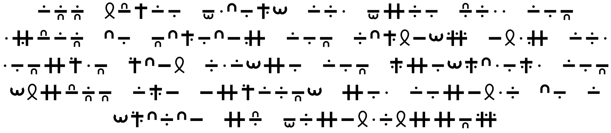

# Condensed-Morse-Code

A condensed writing system for morse code that is human legible and is significantly more space efficient, while also being easy to write by hand. Font included!

Preprint available [here](https://lingbuzz.net/lingbuzz/009470)!
